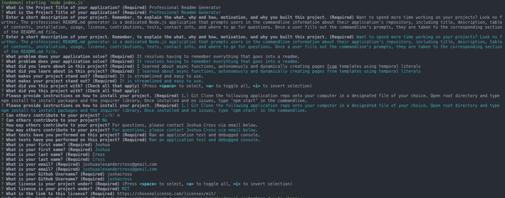

# Professional README Generator

## Description
Want to spend more time working on your projects? Look no further.

The Professional README.md Generator is a dedicated Node.js application that prompts user in the commandline information about their application's repository, including title of the project, deescription, table of contents, installation, usage, license, contibutions, tests, and questions.

Once a user fills out these prompts, they are taken to the corresponding section the README.

## Languages
* HTML
* CSS
* Javascript
* ES6
* Bootstrap
* Node.JS
* NPM Inquire

## Functionality
* Uses node's fs module to copy files from one location to another

* Refactored code by creating Javascript Promises to handle asynchronous functionality 

* ES6 features including destructuring and spread/rest operators and template literals to concatenate variable data

* Node package creation using NPM init to use inquirer library and its dependancies

## How to Run Application
1.) Git Clone the following onto your computer
2.) Open root directory
3.) Commandline type NPM Install to install packages and the inquire library
4.) Once installed and no issues, type "npm start" in the commandline

## Reference Image

